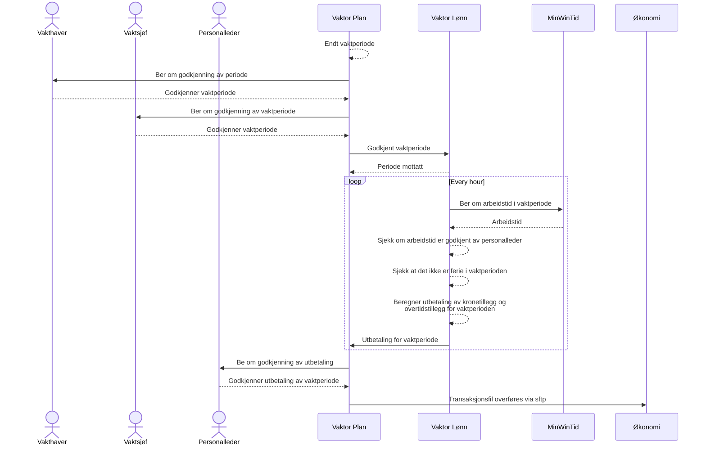

# Vaktor Lønn

Dette er en komponent som regner ut lønn for beredskapsvakt. Lønnen blir beregnet basert på vaktperioden din minus
arbeidet tid.

## Antagelser

- Siden MinWinTid rapporterer på minutter, og vakttillegg regnes i timer, så vil Vaktor Lønn legge sammen alle minutter
  per individuelle vakttillegg i en periode, og så gjøre det om til timer. Dette samsvarer med hvordan økonomi regner
  lignende tillegg (se kommentar til §8 i avtalen om _Beredskapsvakt utenfor arbeidsstedet_).
- Vaktor Lønn vil ikke regne vakttillegg for tid man ikke jobber i kjernetiden, da det da skal være andre på jobb, og
  beredskapsvakt er til for å dekke uforutsette hendelser utenom arbeidstid (se §1 i avtalen om _Beredskapsvakt utenfor
  arbeidsstedet_).
- Vaktor Lønn vil trekke fra tid som overstiger maks vaktperiode per dag. Maks vaktperiode er antall timer i døgnet
  minus arbeidstid for vakthaver (se §5 i avtalen om _Beredskapsvakt utenfor arbeidsstedet_).
- Arbeider man mer enn normert arbeidsdag vil man få det overskyttende trekt fra vaktperioden.
- Vaktor Lønn vil ikke følge med på om man har mer enn lovlig mengde vakt i en periode, eller om man glemmer å føre
  timer.
- Vaktor Lønn vil hente beredskapstillegg, lønn, helligdager, og timelister fra MinWinTid.
- Man kan ikke ha vakt samtidig som man har ferie (se kommentar til §5 i avtalen om _Beredskapsvakt utenfor
  arbeidsstedet_).
- Tilleggene i §15.3 og .4 utbetales i forholdet 1/5 (se §17.1 i _Hovedtariffavtalen_).
- Ved overtid på grunn av vakt så vil MinWinTid betale prosent-overtidstillegget, mens Vaktor Lønn vil regne ut
  kronetillegget. Man vil da ikke få betalt 1/5 av tillegget, men 1/1 per time.

## Flyten i Vaktor



## Utvikling

Det er satt opp CI/CD for automatisk utrulling av kodebasen. I `dev` har vi lagd en mock av MinWinTid som automatisk
genererer arbeidstid innenfor vaktperioden man tester mot. Foreløpig satt til å kjøre utregning hvert 5 minutt.

### Lokalt

For å kjøre lokalt trenger man en egen Postgres database, tilgang til AAD, og mock av MinWinTid.

```shell
make env # krever tilgang til GCP
make db
make mock # i et eget shell
make local
```