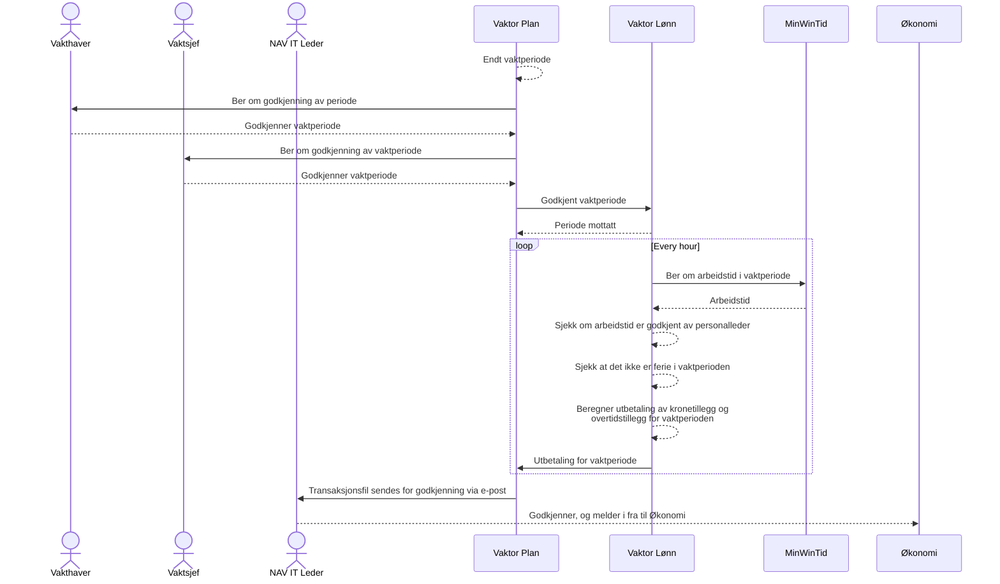

# Vaktor Lønn

Dette er en komponent som regner ut lønn for beredskapsvakt i NAV IT.
Lønnen blir beregnet basert på vaktperioden din minus arbeidet tid.

## Flyten i Vaktor



## Utvikling

Det er satt opp CI/CD for automatisk utrulling av kodebasen.
I `dev` har vi lagd en mock av MinWinTid som automatisk genererer arbeidstid innenfor vaktperioden man tester mot.
Foreløpig satt til å kjøre utregning hvert 5 minutt.

### Lokalt

For å kjøre lokalt trenger man en egen Postgres database, tilgang til Azure AD, og mock av MinWinTid.

```shell
make env # krever tilgang til GCP
make db
make mock # i et eget shell
make local
```
